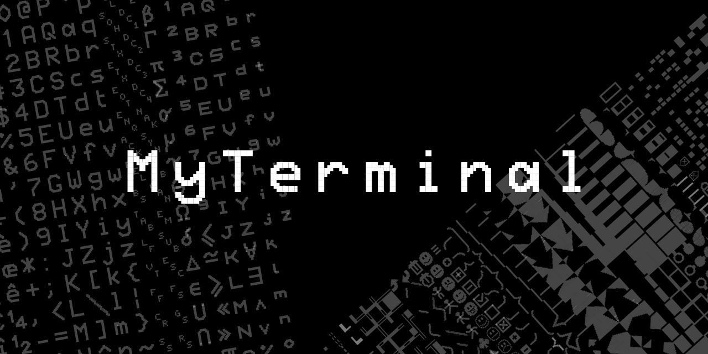

MyTerminal
==========

MyTerminal is a serial terminal implemented on an FPGA.

Characteristics
---------------

- VGA output
  - 1280×1024@60Hz,
  - 16 colors from a 512 colors/9 bits palette
  - 16×20 1024 character set
  - semi-graphic characters
- fast serial input (tested at 3 Mbps)
  - CTSRTS control signal when doing “intensive” operations
  - 8 characters FIFO 
  - UTF-8 support
- low cost (cheap FPGA, 9 resistor DAC…)
- written in Verilog
- inspired by Videotex and text mode video card

Requirements
------------

- Tang SiPeed Primer (Anlogic Eagle EG4S20BG256)
- Tang Dynasty 4.6
- Icarus Verilog
- Python 3
- 

Notes
-----

This is work in progress!
